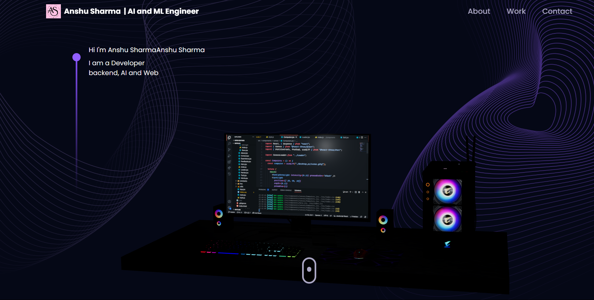

# 🧑‍💻 Anshu Sharma's Developer Portfolio

Welcome to my personal developer portfolio — a dynamic and interactive website built using modern web technologies like **React**, **Vite**, **Tailwind CSS**, and **Three.js**. This project showcases my skills, projects, experience, and contact options in a visually engaging manner.

🌐 **Live Site**: [sharmanshu5.github.io/Portfolio](https://sharmanshu5.github.io/Portfolio)

 <!-- Replace with your actual preview image -->

---

## 🚀 Features

- 🌌 **3D Models using React Three Fiber + Drei** – Enhance UI with interactive 3D elements.
- 🎨 **Tailwind CSS** – Fast and responsive styling using utility classes.
- 💫 **Framer Motion** – Smooth and elegant page transitions and animations.
- ✉️ **EmailJS Integration** – Direct messaging via a contact form.
- 🕰️ **React Vertical Timeline** – Showcase work and education journey.
- 🔁 **React Tilt** – Adds 3D tilt effect on interactive cards.
- 🌐 **React Router DOM** – Smooth routing and navigation.
- 🖼️ **SVG Logo Support** – Clean, scalable logo embedded in the header.
- 📷 **Project Image / 3D Preview Support** – Showcase project thumbnails or 3D model previews.
- 📱 **Fully Responsive** – Optimized for mobile, tablet, and desktop devices.

---

## 🧠 Skills Demonstrated

This project highlights proficiency in:

- **React.js + Vite**: Modern frontend development
- **Tailwind CSS**: Responsive, scalable, and utility-based styling
- **Three.js + React Three Fiber**: Adding interactive 3D objects
- **Framer Motion**: UI/UX animation
- **Form handling & integration**: EmailJS usage for sending messages
- **Asset management**: Handling SVGs, models, images
- **Responsive layout**: Mobile-first and accessible

---

## 📁 Project Structure

portfolio/
├── public/
│ ├── preview-image.png
│ └── favicon.ico
├── src/
│ ├── assets/ # Images, icons, models
│ ├── components/ # Navbar, Hero, About, Projects, Contact, etc.
│ ├── constants/ # Static data (projects, timeline, etc.)
│ ├── pages/ # Main sections
│ ├── App.jsx # Main component
│ ├── main.jsx # Entry point
│ ├── index.css # TailwindCSS base file
├── tailwind.config.js
├── vite.config.js
├── package.json
└── README.md

---

## 🛠️ Tech Stack

| Technology                                                  | Description                             |
|-------------------------------------------------------------|-----------------------------------------|
| [React](https://reactjs.org/)                               | Frontend JavaScript library             |
| [Vite](https://vitejs.dev/)                                 | Fast build tool and development server  |
| [Tailwind CSS](https://tailwindcss.com/)                    | Utility-first CSS framework             |
| [Three.js](https://threejs.org/)                            | WebGL-based 3D library                  |
| [React Three Fiber](https://docs.pmnd.rs/react-three-fiber) | Three.js renderer for React             |
| [Drei](https://github.com/pmndrs/drei)                      | Useful helpers for React Three Fiber    |
| [Framer Motion](https://www.framer.com/motion/)             | Animation library                       |
| [React Router DOM](https://reactrouter.com/en/main)         | Client-side routing                     |
| [EmailJS](https://www.emailjs.com/)                         | Email integration for frontend apps     |
| [React Tilt](https://www.npmjs.com/package/react-tilt)      | Card tilt hover effect                  |

---

## 🖼️ Using SVG Logos

To use an SVG logo:

1. Save your logo as `logo.svg` inside the `public/` or `assets/` folder.
2. Import and use it like this:

```jsx
import Logo from '../assets/logo.svg';


```

🧊 Adding 3D Models or Preview Images
You can include .glb or .gltf 3D models using Three.js:

```jsx
import { Canvas } from '@react-three/fiber';
import { OrbitControls, useGLTF } from '@react-three/drei';

function Model() {
  const gltf = useGLTF('/model.glb'); // path inside public/
  return <primitive object={gltf.scene} scale={1.5} />;
}

<Canvas>
  <ambientLight />
  <directionalLight />
  <Model />
  <OrbitControls />
</Canvas>
```
To generate your 3D .glb and .gltf files:

Use (https://sketchfab.com or https://poly.pizza)

Convert models using (https://gltf.pmnd.rs/)

---
## 📦 Installation and Setup

# Clone and install dependencies
```
git clone https://github.com/sharmanshu5/Portfolio.git
cd Portfolio
npm install --legacy-peer-deps
```

# Initialize Tailwind (if needed)
```
npx tailwindcss init
```

# Build Tailwind CSS (optional in Vite if already set up)
```
npx @tailwindcss/cli -i ./src/index.css -o ./src/index.css --watch
```

# Start dev server
```
npm run dev
```
---

##🌍 Deployment
The portfolio is deployed using GitHub Pages.

To deploy:
# Build the production version
```
npm run build
```

# Then use gh-pages or manually push to gh-pages branch

---
🧾 License
This project is open-source under the MIT License.
---
📫 Contact
Let's connect!

✉️ Email: anshusharma5.as@gmail.com 

🌐 Website: sharmanshu5.github.io/Portfolio

💼 LinkedIn: https://www.linkedin.com/in/anshu-sharma-b74a07221/?utm_source=share&utm_campaign=share_via&utm_content=profile&utm_medium=android_app

🧑‍💻 GitHub: github.com/sharmanshu5

Built with ❤️ by Anshu Sharma
